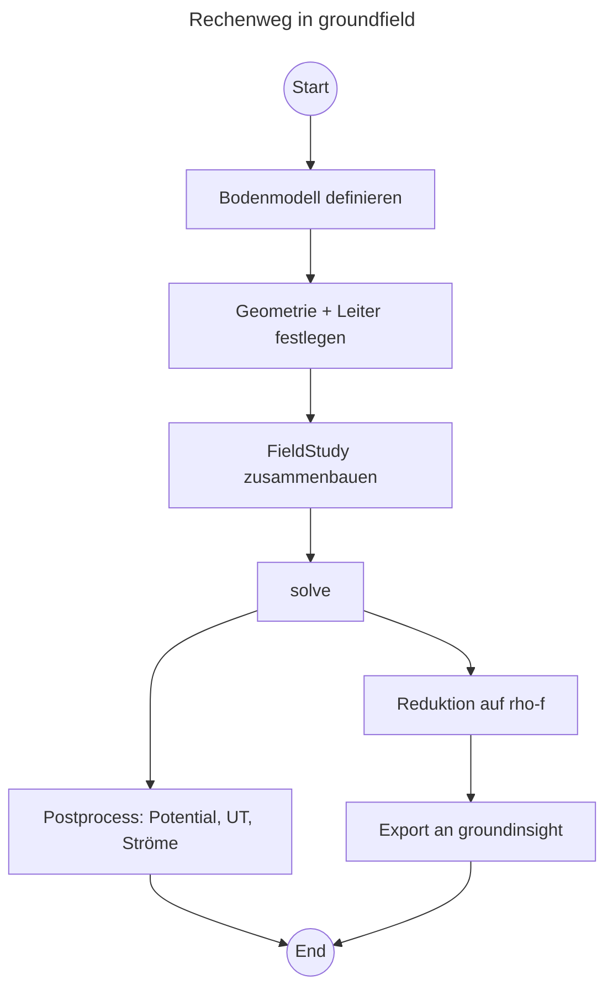

# groundfield

**Numerische Feldberechnung von Erdungsanlagen.**

`groundfield` ist ein Open-Source-Python-Paket für die physikalische
Referenzmodellierung vernetzter Erdungssysteme. Innerhalb der
`groundmeas` / `groundinsight` / `groundfield` Softwarefamilie bildet
`groundfield` die feldtheoretische Seite ab: Bodenmodelle,
Erdergeometrien, Leiter und deren Kopplungen werden als 3D-Problem im
Erdreich formuliert und numerisch gelöst.

## Was `groundfield` tut

Die realen Erdungsanlagen in Mittel- und Niederspannungsnetzen sind
gekoppelte, dreidimensionale und frequenzabhängige Systeme. Für die
Planung, Bewertung und Beobachtung braucht es ein Modell, das die
tatsächliche Stromaufteilung im Fehlerfall physikalisch plausibel
beschreibt. `groundfield` erzeugt genau dieses Referenzmodell — bewusst
als *Referenz, nicht als Endprodukt*: aus der Feldlösung wird ein
reduziertes Ersatzmodell (`rho-f`) abgeleitet, das in `groundinsight`
als `BusType`- oder `BranchType`-Formel weiter verwendet wird.

## Workflow

## Nächste Schritte

- [Installation](installation.md) — Poetry-Setup, Docs-Gruppe, VS Code.
- [Schnelleinstieg](quickstart.md) — erste Feldrechnung.
- [Konzepte](concepts.md) — was `groundfield` von einem reinen FEM-Tool
  unterscheidet.
- [API-Referenz](api/index.md) — generiert per `mkdocstrings` aus den
  Docstrings.
