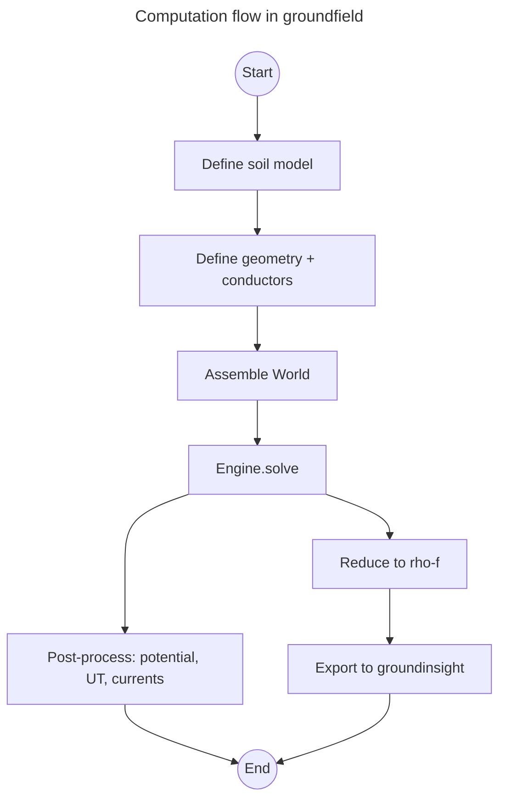

# groundfield

**Numerical field computation for grounding systems.**

`groundfield` is an open-source Python package for the physical
reference modelling of networked grounding systems. Within the
`groundmeas` / `groundinsight` / `groundfield` software family,
`groundfield` covers the field-theoretical side: soil models,
electrode geometries, conductors and their couplings are formulated as
a 3-D problem in the soil and solved numerically.

## What `groundfield` does

Real grounding systems in medium- and low-voltage distribution
networks are coupled, three-dimensional and frequency-dependent.
Planning, evaluation, and monitoring require a model that captures the
actual current distribution under fault conditions in a physically
plausible way. `groundfield` produces this reference model —
deliberately as a *reference, not as the end product*: from the field
solution a reduced equivalent model (`rho-f`) is derived and passed to
`groundinsight` as a `BusType` or `BranchType` impedance formula.

## Workflow

## Next steps

- [Installation](installation.md) — Poetry setup, docs group, VS Code.
- [Quickstart](quickstart.md) — first field computation.
- [Concepts](concepts.md) — what makes `groundfield` different from a
  generic FEM tool.
- [API reference](api/index.md) — generated by `mkdocstrings` from the
  source docstrings.
